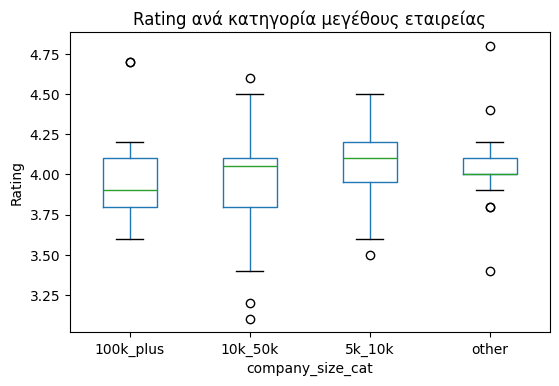
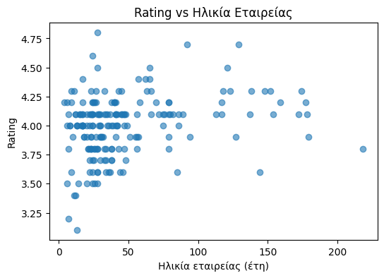
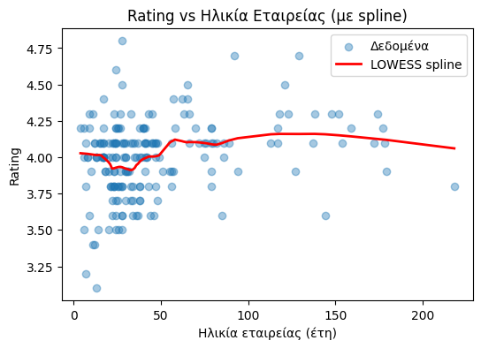
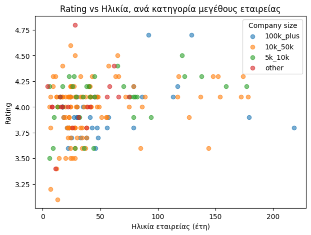
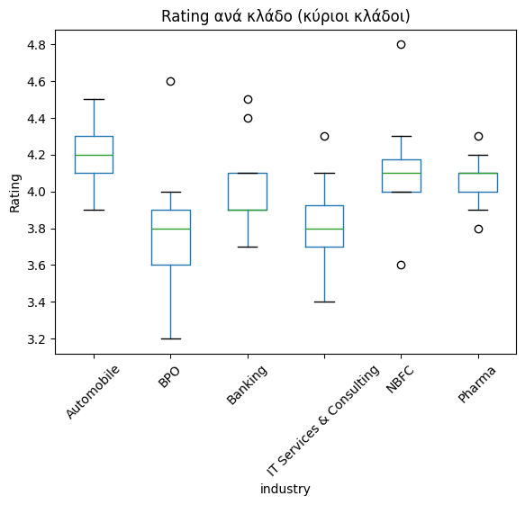

# Εισαγωγή

Η παρούσα αναφορά αποτελεί διερευνητική ανάλυση
(company-level exploratory analysis) ενός dataset
200 εταιρειών, με στόχο την κατανόηση πιθανών
μοτίβων μεταξύ αξιολόγησης (rating), μεγέθους,
ηλικίας και κλάδου δραστηριότητας.

Η ανάλυση είναι **περιγραφική και μη αιτιώδης**.

---

# Περιγραφή & Προετοιμασία Δεδομένων

## Αποσύνθεση σύνθετης μεταβλητής

Η αρχική μεταβλητή `ctype` περιείχε σύνθετες πληροφορίες
(κλάδος, μέγεθος, ηλικία, διακρίσεις) σε ενιαία μορφή κειμένου.
Για λόγους αναλυτικής σαφήνειας, η μεταβλητή αποσυντέθηκε
σε επιμέρους χαρακτηριστικά, τα οποία χρησιμοποιήθηκαν
ξεχωριστά στην ανάλυση.

## Εξαγωγή ηλικίας εταιρείας

Η ηλικία της εταιρείας εξήχθη αποκλειστικά από
κειμενικές εγγραφές που περιείχαν ρητά τη φράση
**“years old”**. Αριθμητικές τιμές που προέρχονταν
από άλλες πηγές (π.χ. rankings ή πλήθος τοποθεσιών)
αγνοήθηκαν, ώστε να αποφευχθεί εσφαλμένη ερμηνεία.

## Καθαρισμός στηλών

Μετά την αποσύνθεση της σύνθετης μεταβλητής `ctype`,
οι ενδιάμεσες και μη αναλυτικά έγκυρες στήλες
(`ctype`, `company_age_raw`, `labels`)
αφαιρέθηκαν από το τελικό σύνολο δεδομένων.

Η ανάλυση βασίζεται αποκλειστικά σε μεταβλητές
με σαφή και μονοσήμαντη σημασιολογία.

---

# Τελικό Σύνολο Δεδομένων

| Μεταβλητή | Περιγραφή |
|---------|----------|
| name | Όνομα εταιρείας |
| rating | Υποκειμενική αξιολόγηση |
| industry | Κλάδος δραστηριότητας |
| company_age | Ηλικία εταιρείας (έτη) |
| company_size | Πρωτογενής περιγραφή μεγέθους |
| company_size_cat | Κανονικοποιημένη κατηγορία μεγέθους |
| company_size_min | Κατώφλι εργαζομένων (proxy) |

> Πρωτογενείς περιγραφικές στήλες διατηρήθηκαν
> μόνο για σκοπούς τεκμηρίωσης και δεν
> χρησιμοποιήθηκαν άμεσα στη στατιστική ανάλυση.

---

# Ανάλυση Μεγέθους Εταιρείας και Rating

## Έλεγχος διαφορών (Kruskal–Wallis)

Ο μη παραμετρικός έλεγχος Kruskal–Wallis έδειξε
στατιστικά σημαντική διαφορά στα ratings μεταξύ
κατηγοριών μεγέθους εταιρείας:

- **H = 9.65**
- **p = 0.022**

Ωστόσο, οι διαφορές στα κεντρικά μέτρα είναι μικρές
και οι κατανομές παρουσιάζουν έντονη επικάλυψη.

## Μέγεθος επίδρασης (Effect Size)

### Epsilon squared (ε²)

Τύπος:

\[
ε² = {H - k + 1}/{n - k}
\]

όπου:

- H: στατιστική Kruskal–Wallis  
- k: αριθμός ομάδων  
- n: συνολικό πλήθος παρατηρήσεων  

| ε² | Ερμηνεία |
|----|---------|
| < 0.01 | αμελητέο |
| 0.01 – 0.06 | μικρό |
| 0.06 – 0.14 | μέτριο |
| > 0.14 | μεγάλο |

Το αποτέλεσμα (**ε² ≈ 0.034**) υποδηλώνει
**μικρό μέγεθος επίδρασης**.

---

# Ηλικία Εταιρείας και Rating

==========================================================

Η συσχέτιση μεταξύ ηλικίας εταιρείας και rating
είναι θετική αλλά ασθενής:

- **Spearman ρ ≈ 0.26**
- **p < 0.001**

Η οπτική διερεύνηση με LOWESS spline δείχνει:

- ήπια αύξηση του rating σε νεότερες ηλικίες,
- σταθεροποίηση σε μεγαλύτερες ηλικίες,
- αύξηση της διασποράς (ετεροσκεδαστικότητα).

---

# Πολυπαραγοντική Διερεύνηση

## Μέγεθος + Ηλικία → Rating

Η ταυτόχρονη διερεύνηση ηλικίας και μεγέθους
δεν αποκαλύπτει διακριτές ομάδες rating.
Οι κατηγορίες μεγέθους παρουσιάζουν σημαντική
επικάλυψη, ενώ η αύξηση της διασποράς με την ηλικία
παρατηρείται ανεξαρτήτως μεγέθους εταιρείας.

## Κλάδος (Industry) και Rating

Η ανάλυση ανά κλάδο δείχνει ότι:

- η σχέση ηλικίας–rating δεν είναι ομοιόμορφη,
- ορισμένοι κλάδοι εμφανίζουν μεγαλύτερη σταθερότητα,
- άλλοι μεγαλύτερη ετερογένεια.

Δεν προκύπτει καθολικό μοτίβο.

---

# Τι ΔΕΝ λένε τα δεδομένα

## 1. Αιτιότητα
Τα δεδομένα δεν επιτρέπουν αιτιώδη ερμηνεία.
Η ανάλυση είναι παρατηρησιακή και όχι πειραματική.

## 2. Αντικειμενική ποιότητα
Το rating αποτελεί υποκειμενική αξιολόγηση και
δεν συνιστά αντικειμενικό δείκτη απόδοσης.

## 3. Πρακτική σημασία
Οι στατιστικά σημαντικές διαφορές δεν συνεπάγονται
αναγκαστικά πρακτικά σημαντικές διαφορές.

## 4. Πρόβλεψη
Η ανάλυση δεν επιτρέπει αξιόπιστη πρόβλεψη rating.

## 5. Περιορισμοί dataset
- άνισα μεγέθη ομάδων
- απουσία χρονικής διάστασης
- έλλειψη οικονομικών και γεωγραφικών δεδομένων

---

# Συμπέρασμα

Η ανάλυση προσφέρει χρήσιμη διερευνητική εικόνα,
αναδεικνύοντας μοτίβα και ετερογένεια χωρίς να
υποστηρίζει ισχυρά ή αιτιώδη συμπεράσματα.
Η αξία της έγκειται στην κατανόηση και όχι
στη γενίκευση ή την πρόβλεψη.
