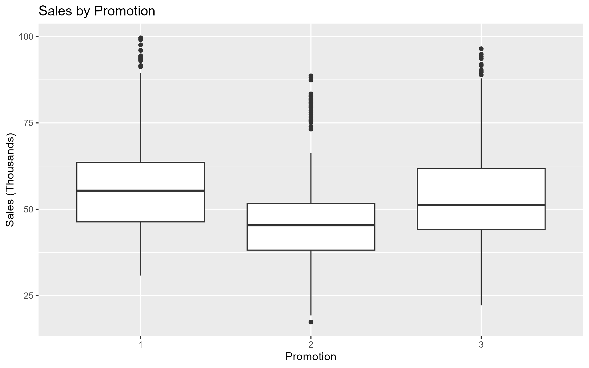
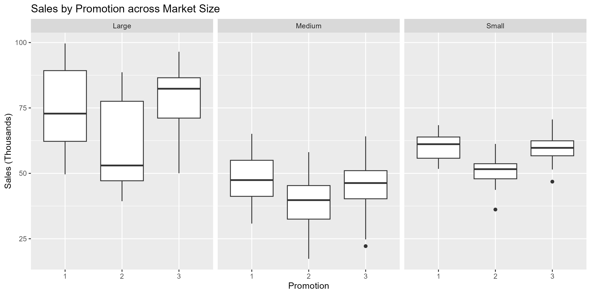
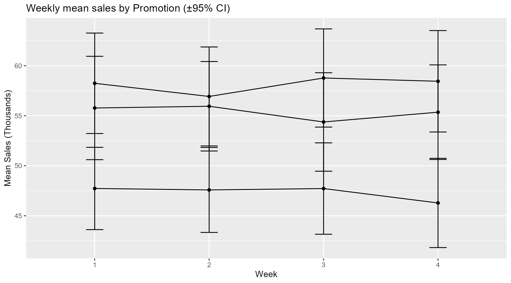
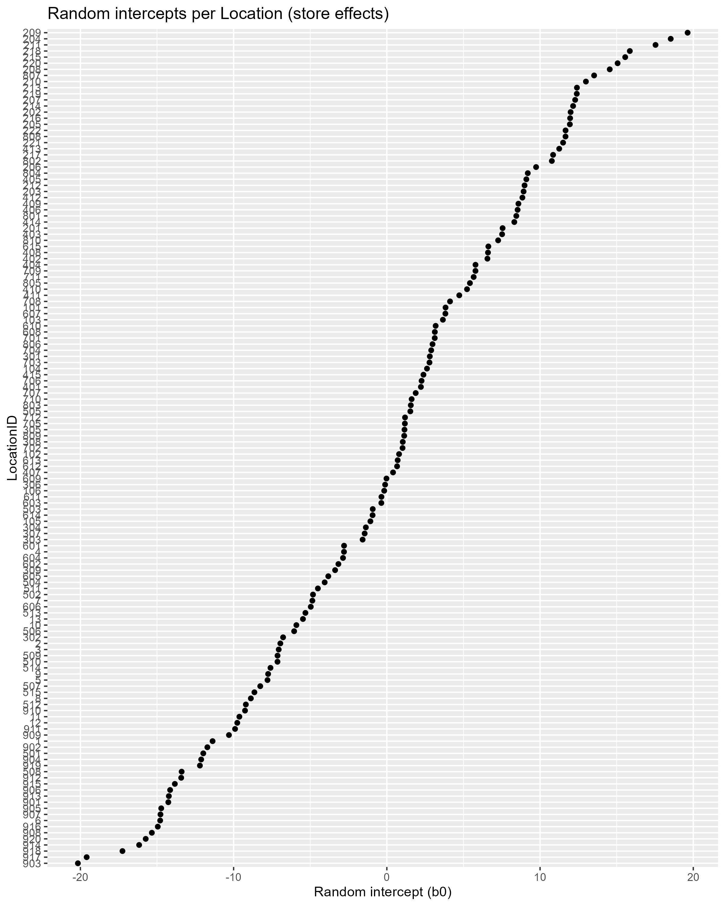
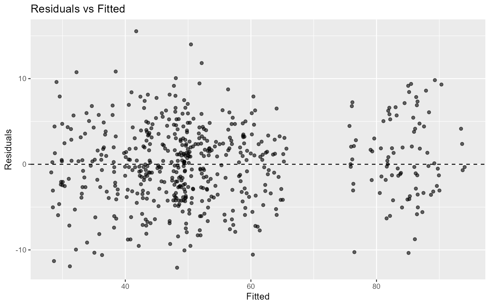
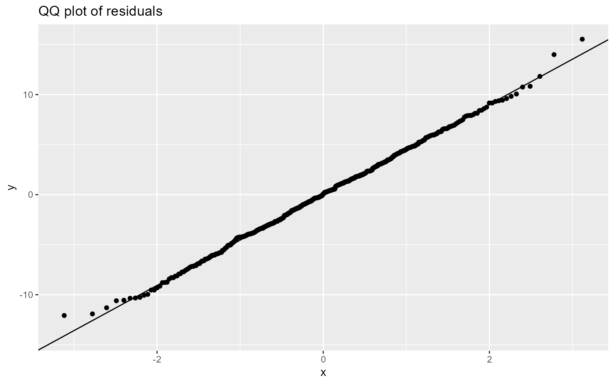

# WA Marketing Campaign — A/B Test (Promotions 1–3) with Linear Mixed Model (R)

Στόχος: να εκτιμηθεί ποια **προωθητική ενέργεια (Promotion 1/2/3)** οδηγεί σε υψηλότερες πωλήσεις, λαμβάνοντας υπόψη ότι κάθε κατάστημα παρατηρείται **επαναλαμβανόμενα** για 4 εβδομάδες.

## Executive summary (TL;DR)

- Η **Promotion 2** υποαποδίδει σημαντικά έναντι της baseline **Promotion 1** (≈ −10.75k σε SalesInThousands).
- Η **Promotion 3** είναι περίπου **ισοδύναμη** με την Promotion 1 (μη στατιστικά σημαντική διαφορά).
- Υπάρχει έντονη **ετερογένεια ανά κατάστημα** (random intercept SD ≈ 9.75), άρα το **mixed model** είναι κατάλληλο.

---

## Dataset

- **File:** `WA_Marketing-Campaign.csv`
- **Shape:** 548 rows × 7 columns
- **Unit of observation:** 1 γραμμή = 1 κατάστημα (`LocationID`) × 1 εβδομάδα (`week`)
- **Repeated measures:** κάθε `LocationID` εμφανίζεται για εβδομάδες **1..4** (4 παρατηρήσεις/κατάστημα)

### Data dictionary (columns)

- `SalesInThousands` — Πωλήσεις (σε χιλιάδες) *(outcome / target)*
- `Promotion` — Προωθητική ενέργεια *(treatment: 1/2/3)*
- `week` — Εβδομάδα δοκιμής *(1..4)*
- `MarketSize` — Μέγεθος αγοράς *(Small / Medium / Large)*
- `AgeOfStore` — Ηλικία καταστήματος (έτη)
- `LocationID` — Αναγνωριστικό καταστήματος *(grouping για random effect)*
- `MarketID` — Αναγνωριστικό αγοράς/περιοχής *(descriptive)*

### Table 1 — Sample rows (schema preview)

> Βάλε εδώ το `<table>...</table>` που ήδη έφτιαξες, για να φαίνεται το schema & δείγμα γραμμών.

<table>
  <caption><strong>Table 1.</strong> Δείγμα 10 γραμμών από το WA_Marketing-Campaign.csv (548×7).</caption>

  <thead>
    <tr>
      <th>MarketID</th>
      <th>MarketSize</th>
      <th>LocationID</th>
      <th>AgeOfStore</th>
      <th>Promotion</th>
      <th>week</th>
      <th>SalesInThousands</th>
    </tr>
  </thead>
  <tbody>
    <tr><td>1</td><td>Medium</td><td>1</td><td>4</td><td>3</td><td>1</td><td>33.7</td></tr>
    <tr><td>1</td><td>Medium</td><td>1</td><td>4</td><td>3</td><td>2</td><td>35.7</td></tr>
    <tr><td>1</td><td>Medium</td><td>1</td><td>4</td><td>3</td><td>3</td><td>29.0</td></tr>
    <tr><td>1</td><td>Medium</td><td>1</td><td>4</td><td>3</td><td>4</td><td>39.2</td></tr>
    <tr><td>1</td><td>Medium</td><td>2</td><td>5</td><td>2</td><td>1</td><td>27.8</td></tr>
    <tr><td>1</td><td>Medium</td><td>2</td><td>5</td><td>2</td><td>2</td><td>34.7</td></tr>
    <tr><td>1</td><td>Medium</td><td>2</td><td>5</td><td>2</td><td>3</td><td>28.0</td></tr>
    <tr><td>1</td><td>Medium</td><td>2</td><td>5</td><td>2</td><td>4</td><td>27.7</td></tr>
    <tr><td>1</td><td>Medium</td><td>3</td><td>12</td><td>1</td><td>1</td><td>44.5</td></tr>
    <tr><td>1</td><td>Medium</td><td>3</td><td>12</td><td>1</td><td>2</td><td>37.9</td></tr>
  </tbody>
</table>
---

## Exploratory Data Analysis (EDA)

Στόχος: να δούμε γρήγορα διαφορές/μοτίβα πριν το μοντέλο.

### Figure 1 — Sales distribution by Promotion (boxplot)



### Figure 2 — Sales by Promotion across Market Size (facet boxplots)



### Figure 3 — Weekly mean sales by Promotion (±95% CI)



---

## Methodology

### Why Mixed Effects?
Οι παρατηρήσεις **δεν είναι ανεξάρτητες**, επειδή κάθε κατάστημα (`LocationID`) εμφανίζεται 4 φορές (week 1..4).  
Για να μοντελοποιηθεί η store-to-store μεταβλητότητα, χρησιμοποιούμε **Linear Mixed Effects Model** με **random intercept** ανά κατάστημα.

### Model specification (primary)

**Formula:**
`SalesInThousands ~ Promotion + week + MarketSize + AgeOfStore + (1 | LocationID)`

- Fixed effects: `Promotion`, `week`, `MarketSize`, `AgeOfStore`
- Random effects: `(1 | LocationID)` (τυχαία σταθερά ανά κατάστημα)
- Estimation: REML
- Inference: Satterthwaite df (lmerTest)

---

## Results

### Table 2 — Model fit & Random effects (summary)

> Επικόλλησε εδώ τον markdown pipe table που παράγεις από R (random effects + N, groups, REML).
>
> Ελάχιστα που θέλουμε να φαίνονται:
> - Std.Dev(LocationID intercept)
> - Std.Dev(residual)
> - Observations (548)
> - Groups LocationID (137)
> - REML criterion

(Επικόλληση εδώ)

### Table 3 — Fixed effects (Estimate, SE, df, t, p)

> Επικόλλησε εδώ τον markdown pipe table από R με τους fixed effects.

(Επικόλληση εδώ)

#### Interpretation (fixed effects)
- **Promotion2:** αρνητική επίδραση έναντι της baseline **Promotion1** και στατιστικά σημαντική.
- **Promotion3:** μικρή/μη σημαντική διαφορά έναντι της **Promotion1**.
- **MarketSize (Medium/Small):** ισχυρή πτώση πωλήσεων έναντι του baseline (Large).
- **AgeOfStore:** μικρή/μη σημαντική επίδραση.

### Table 4 — Pairwise comparisons (Promotions) with CI

> Επικόλλησε εδώ τον πίνακα από `emmeans` (pairwise comparisons ή/και estimated means + CI).

(Επικόλληση εδώ)

#### Decision takeaway
- **Απόρριψε Promotion 2.**
- **Promotion 1 και Promotion 3**: παρόμοια απόδοση (με βάση τα διαθέσιμα δεδομένα/μοντέλο).

---

## Diagnostics & validity checks

### Figure 4 — Random intercepts per Location (store heterogeneity)



### Figure 5 — Residuals vs Fitted



### Figure 6 — QQ plot of residuals



---

## Conclusions

- Η **Promotion 2** είναι σταθερά χειρότερη από την baseline **Promotion 1** (με έλεγχο για week/MarketSize/AgeOfStore και random intercept ανά LocationID).
- Η **Promotion 3** δεν δείχνει ουσιαστικά διαφορετική απόδοση από την **Promotion 1**.
- Η μεταβλητότητα ανά κατάστημα είναι μεγάλη (store effects), άρα το mixed model είναι κατάλληλη επιλογή.
- Πρακτικά: **μην επιλέξεις Promotion 2**. Μεταξύ **1** και **3**, η επιλογή μπορεί να βασιστεί σε άλλα επιχειρησιακά κριτήρια (κόστος καμπάνιας, logistics κ.λπ.).

---

## Reproducibility (How to run)

### R packages
- `readr`, `dplyr`, `ggplot2`
- `lme4`, `lmerTest`
- *(optional για πίνακες)* `knitr` (ή base-R pipe table printer)

### Generate figures (saved under `docs/figs/`)
Τρέξε το script που κάνει `ggsave()` στα παρακάτω paths:
- `docs/figs/01_sales_by_promo.png`
- `docs/figs/02_sales_by_promo_market.png`
- `docs/figs/03_weekly_means_ci.png`
- `docs/figs/04_random_intercepts.png`
- `docs/figs/05_resid_vs_fitted.png`
- `docs/figs/06_qq_residuals.png`

### Fit the model
```r
m <- lmer(SalesInThousands ~ Promotion + week + MarketSize + AgeOfStore + (1|LocationID), data=df)
summary(m)
