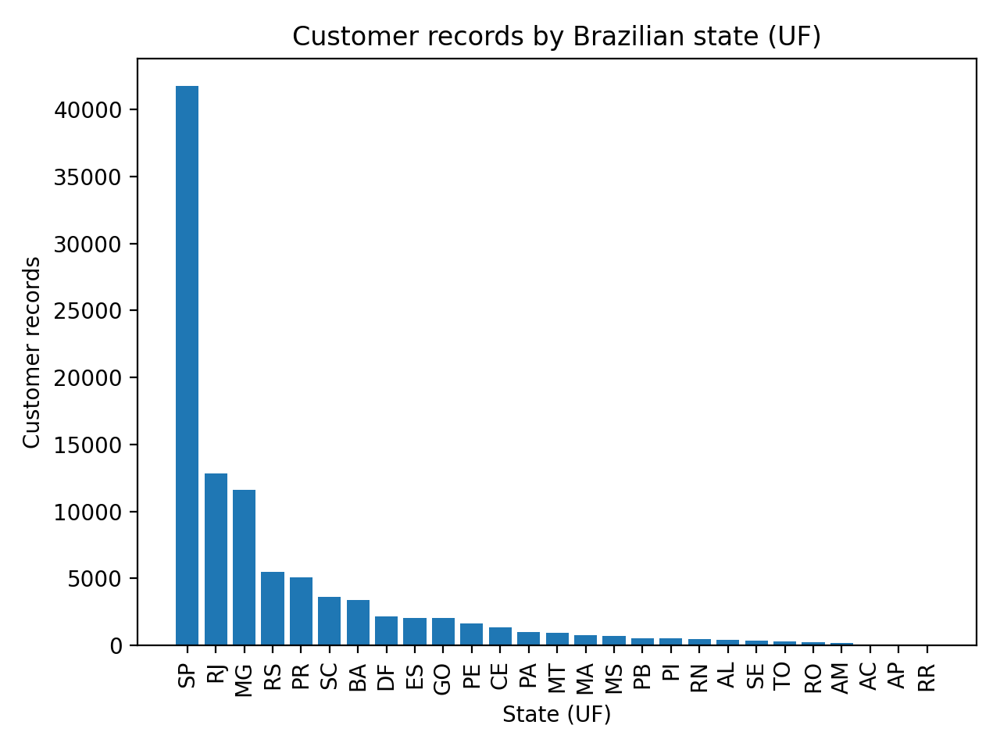
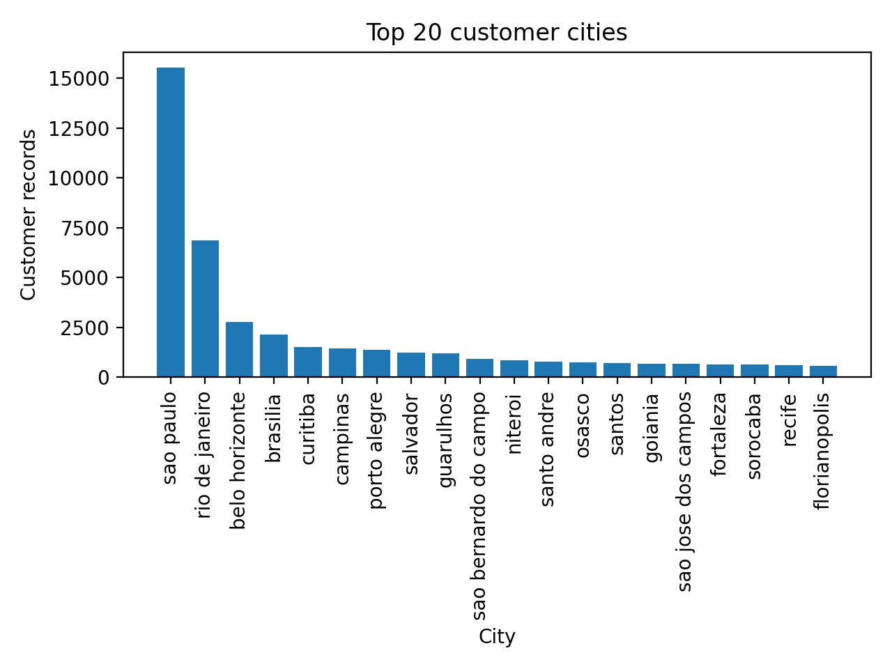
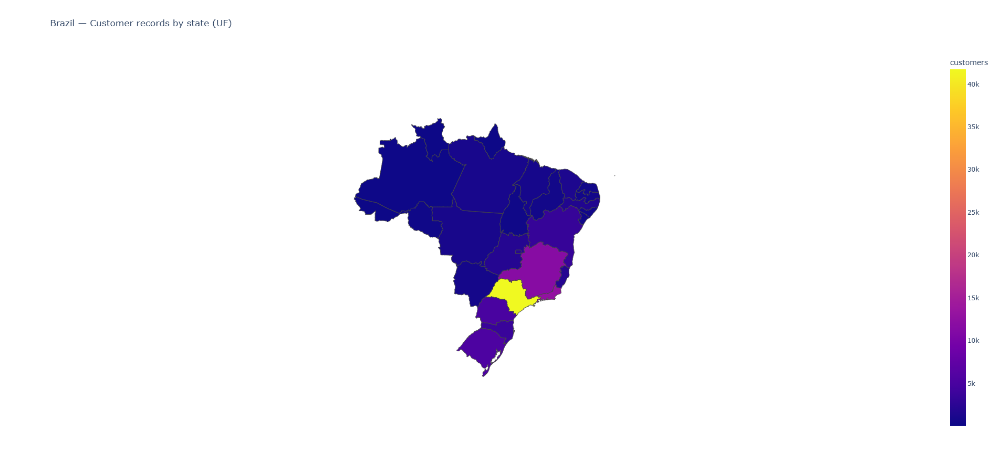
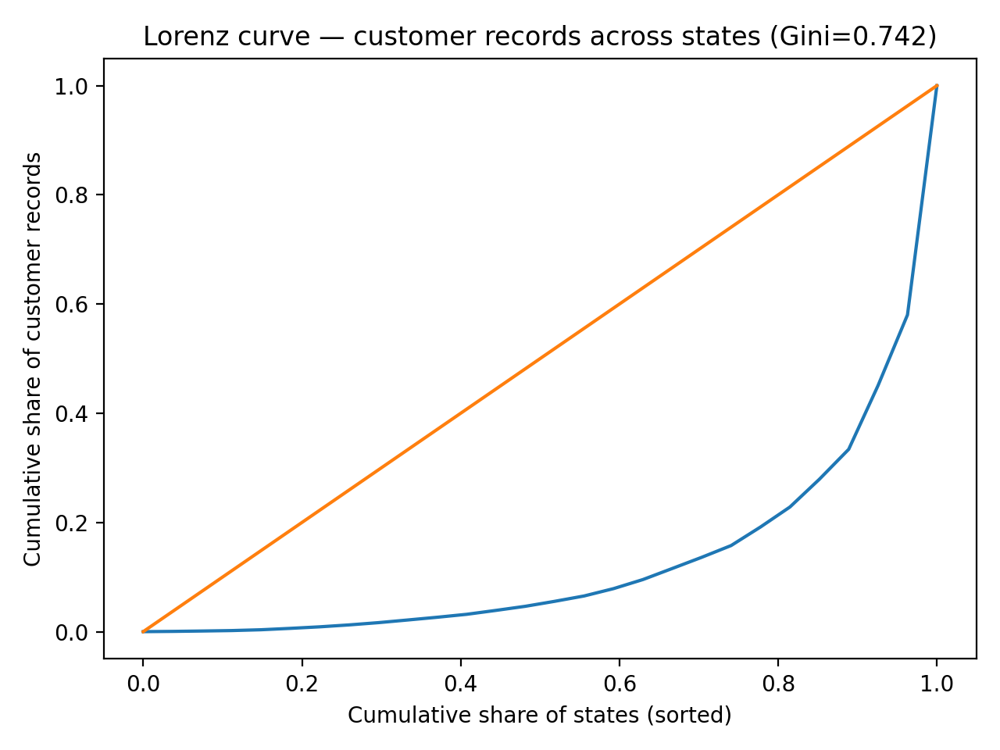
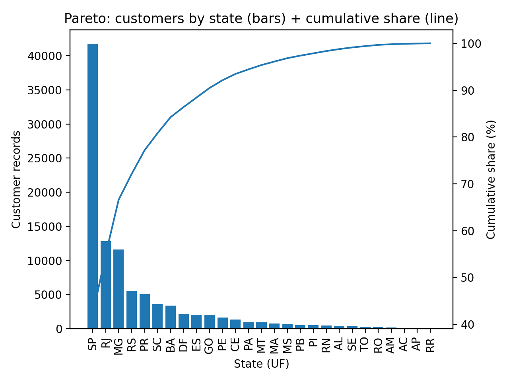

# Olist (Brazil) — Γεωγραφική κατανομή πελατών (Customer records)

## Scope
Ανάλυση γεωγραφικής κατανομής πελατών με βάση το dataset:
- `olist_customers_dataset_ecommerce_brazilian.csv`

**Σημαντικός περιορισμός:** το dataset customers είναι *dimension table* και δεν περιέχει:
- timestamps (πότε έγινε αγορά)
- orders (πόσες αγορές έκανε ο πελάτης)
- ποσά/GMV

Άρα τα αποτελέσματα αποτυπώνουν **κατανομή customer records (proxy ζήτησης)** και όχι επιβεβαιωμένη **κατανομή αγορών**.

---

## Data dictionary (στήλες που χρησιμοποιήθηκαν)
- `customer_id`: instance id πελάτη (συνδέεται με orders σε πλήρες schema Olist)
- `customer_unique_id`: “person id” (ο ίδιος άνθρωπος μπορεί να εμφανιστεί πολλαπλές φορές)
- `customer_zip_code_prefix`: πρόθεμα ταχυδρομικού κώδικα
- `customer_city`: πόλη
- `customer_state`: πολιτεία (UF)

---

## Output artifacts (πίνακες & γραφήματα)

### Σύνοψη
- [summary_metrics.csv](olist_geo_analysis/summary_metrics.csv)

### Κατανομή ανά πολιτεία (UF)
- Πλήρης πίνακας: [state_distribution_all.csv](olist_geo_analysis/state_distribution_all.csv)
- Top 10: [top10_states.csv](olist_geo_analysis/top10_states.csv)
- Γράφημα (bar):  
  

### Κατανομή ανά πόλη
- Top 20 πόλεις: [top20_cities.csv](olist_geo_analysis/top20_cities.csv)
- Γράφημα (bar):  
  

### Top 5 πόλεις μέσα στις top 5 πολιτείες
- [top5_cities_each_top5_states.csv](olist_geo_analysis/top5_cities_each_top5_states.csv)

---

## Key findings (με βάση customer records)
- Η πολιτεία **SP** συγκεντρώνει ~42% των customer records.
- Οι **SP + RJ + MG** συγκεντρώνουν ~66.6% (έντονη χωρική συγκέντρωση).
- Η πόλη **São Paulo** μόνη της είναι ~15.6% των customer records.

> Για ακριβή “γεωγραφική κατανομή αγορών” απαιτείται πίνακας **orders** ώστε να μετρήσουμε **orders/GMV ανά `customer_id`** και να τα χαρτογραφήσουμε γεωγραφικά.
>
> Σε αυτή τη φάση, η ανάλυση βασίζεται σε **customer records** (γεωγραφική κατανομή πελατειακής βάσης / proxy ζήτησης).

---

## Concentration & geography artifacts (current dataset: customers only)

### Heatmap ανά πολιτεία (UF)
- Interactive: [`brazil_states_heatmap_customers.html`](olist_geo_analysis/brazil_states_heatmap_customers.html)
- Static (προτείνεται για GitHub embed): `brazil_states_heatmap_customers.svg`
  - Παράγεται με Plotly + kaleido (βλ. οδηγίες export).
  - 

### Lorenz & Gini (ανισοκατανομή μεταξύ πολιτειών)
- Lorenz curve:
  

- Gini coefficient (states, based on customer records): **0.741922**
  - Source: [`gini_states.txt`](olist_geo_analysis/gini_states.txt)

### Pareto (optional)
- 

---

## Next steps
1. Επιλογή τελικού σετ οπτικοποιήσεων για report/repo:
   - Heatmap (γεωγραφικό “πού”)
   - Lorenz/Gini & Pareto (ποσοτικό “πόσο άνισα”)
2. Αν προστεθεί orders dataset στο μέλλον:
   - μετάβαση από “customer records” → “orders / GMV” ανά πολιτεία/πόλη
   - χρονική ανάλυση με timestamps από orders (π.χ. 2016–2018, αν επιβεβαιωθεί από min/max dates)
