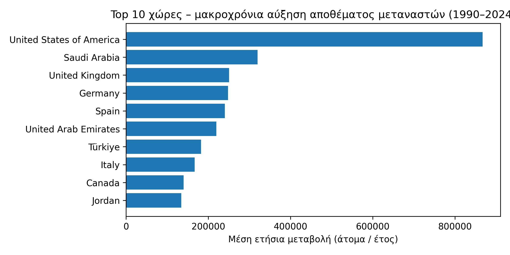
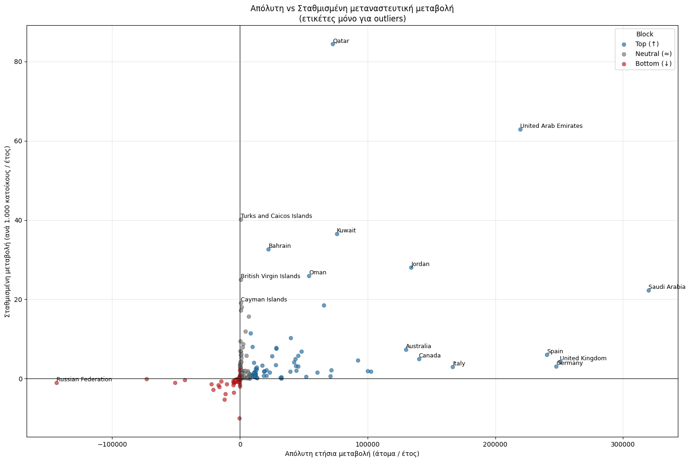
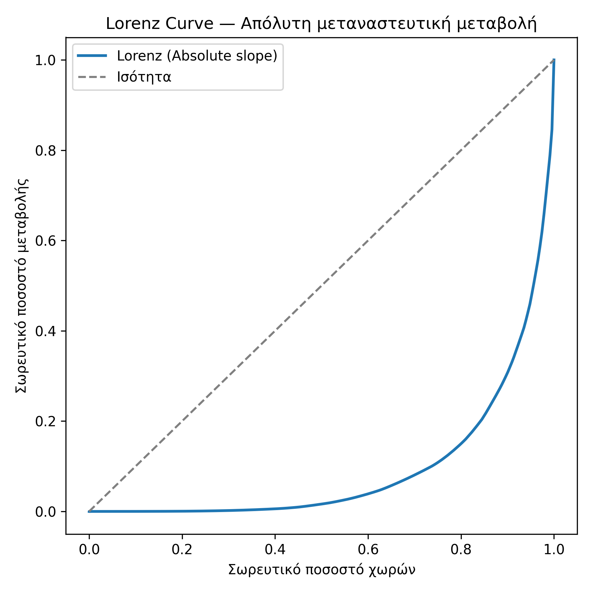
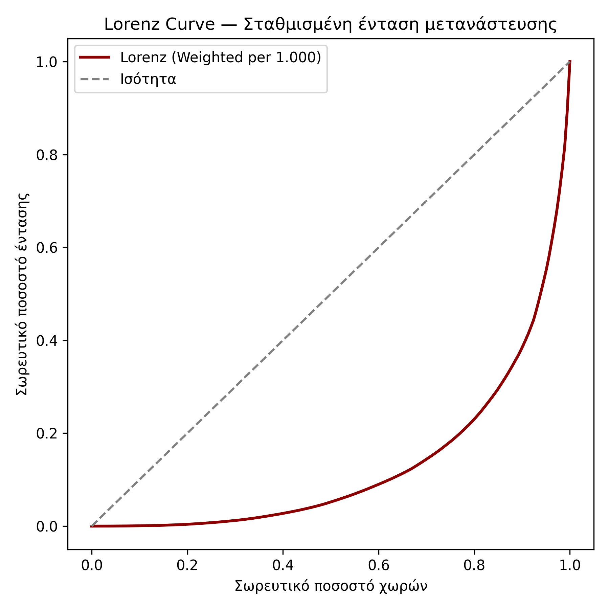

# Οι πληθυσμιακές κατανομές και η μακροχρόνια μεταβολή του αποθέματος μεταναστών (1990–2024)

## 1. Εισαγωγή

Η παρούσα ανάλυση εξετάζει τη μακροχρόνια μεταβολή του αποθέματος μεταναστών
σε παγκόσμιο επίπεδο για την περίοδο 1990–2024, συνδυάζοντας δύο συμπληρωματικές
προσεγγίσεις:

- **απόλυτες μεταβολές** (άτομα ανά έτος)

- **σταθμισμένες μεταβολές** ως προς τον πληθυσμό (ανά 1.000 κατοίκους)

Στόχος είναι να αποτυπωθεί όχι μόνο το συνολικό μέγεθος της μεταναστευτικής
μεταβολής, αλλά και η έντασή της σε σχέση με το πληθυσμιακό μέγεθος κάθε χώρας.
Με τον τρόπο αυτό αποφεύγεται η υποεκτίμηση χωρών με μικρό πληθυσμό αλλά
υψηλή σχετική μεταναστευτική πίεση.

## 2. Δεδομένα και Μεθοδολογία

### 2.1 Πηγές δεδομένων
Η ανάλυση βασίζεται σε δύο κύρια σύνολα δεδομένων:

- Απόθεμα μεταναστών ανά χώρα (διεθνείς βάσεις / ΟΗΕ)

- Πληθυσμιακά δεδομένα ανά χώρα (μέσος πληθυσμός περιόδου)

Τα δεδομένα καλύπτουν πενταετείς παρατηρήσεις από το 1990 έως το 2024 και έχουν
εναρμονιστεί ως προς τις χρονικές περιόδους και τις ονομασίες χωρών.

Σημείωση ταξινόμησης:
Η ηπειρωτική κατηγοριοποίηση βασίζεται στη μεταβλητή `continent`
όπως παρέχεται στο σύνολο δεδομένων αποθέματος μεταναστών.
Στο παρόν dataset δεν εμφανίζεται ξεχωριστή κατηγορία
«Northern America», με αποτέλεσμα χώρες όπως οι Ηνωμένες Πολιτείες
και ο Καναδάς να εντάσσονται σε άλλες γεωγραφικές κατηγορίες
σύμφωνα με την αρχική ταξινόμηση της πηγής.

### 2.2 Υπολογισμός μακροχρόνιας τάσης

Για κάθε χώρα εκτιμήθηκε η μακροχρόνια τάση του αποθέματος μεταναστών μέσω
γραμμικής παλινδρόμησης ως προς τον χρόνο.
Η εκτιμώμενη κλίση (slope) εκφράζει:

> τη μέση ετήσια μεταβολή του αποθέματος μεταναστών (άτομα ανά έτος)

Η γραμμική τάση χρησιμοποιείται αποκλειστικά ως περιγραφικό εργαλείο
μακροχρόνιας κατεύθυνσης και όχι ως πρόβλεψη.

### 2.3 Στάθμιση ως προς τον πληθυσμό

Η σταθμισμένη μεταβολή ορίζεται ως:

> ετήσια μεταβολή αποθέματος μεταναστών ανά 1.000 κατοίκους

Η στάθμιση επιτρέπει τη συγκρισιμότητα χωρών με πολύ διαφορετικό
πληθυσμιακό μέγεθος και αναδεικνύει περιπτώσεις υψηλής μεταναστευτικής έντασης.

## 3. Κατηγοριοποίηση χωρών

Οι χώρες ομαδοποιήθηκαν σε τρία διακριτά μπλοκ:

- **Top (↑)**: θετική και ουσιαστική μακροχρόνια αύξηση
- **Neutral (≈)**: σχεδόν μηδενική μακροχρόνια μεταβολή
- **Bottom (↓)**: καθαρή μακροχρόνια μείωση

Η κατηγοριοποίηση λειτουργεί ως αναλυτικό εργαλείο σύγκρισης
και όχι ως αξιολογική κατάταξη.

### Πίνακας 1: Σύνοψη κατηγοριών χωρών

| Κατηγορία   | Πλήθος χωρών | Μέση ετήσια μεταβολή (άτομα) | Μέση σταθμισμένη μεταβολή |
| ----------- | ------------ | ---------------------------- | ------------------------- |
| Top (↑)     | 67           | 63.962                       | 7.12                      |
| Neutral (≈) | 60           | 1.770                        | 4.49                      |
| Bottom (↓)  | 58           | -7.257                       | -0.81                     |

## 3.1 Ανά ήπειρο (stacked bar)

Η ποσοστιαία κατανομή των χωρών ανά μπλοκ μακροχρόνιας μεταναστευτικής τάσης παρουσιάζει έντονες διαφοροποιήσεις μεταξύ ηπείρων.

Ειδικά στην <b>Ωκεανία</b>, η μεγάλη συγκέντρωση χωρών στο <b>μπλοκ μείωσης (Bottom)</b> αντανακλά το <i>μικρό απόλυτο πλήθος χωρών και τη δυσανάλογη επίδραση λίγων περιπτώσεων</i>.

Για τον λόγο αυτό, η ερμηνεία των ποσοστών συνοδεύεται από απόλυτες κατανομές και πίνακες, ώστε να αποφεύγονται οπτικές παρανοήσεις.

## 4. Κύρια Αποτελέσματα

### 4.1 Απόλυτη μεταβολή αποθέματος μεταναστών

Στο Σχήμα 1 παρουσιάζονται οι δέκα χώρες με τη μεγαλύτερη μέση ετήσια
αύξηση αποθέματος μεταναστών σε απόλυτους όρους.

Οι χώρες με μεγάλο πληθυσμό και ισχυρούς μεταναστευτικούς
διαδρόμους κυριαρχούν στην απόλυτη κατάταξη.

### 4.2 Σταθμισμένη μεταβολή (ανά 1.000 κατοίκους)

Η σταθμισμένη προσέγγιση αναδεικνύει διαφορετικά πρότυπα,
με χώρες μικρότερου πληθυσμού να εμφανίζουν πολύ υψηλή
μεταναστευτική ένταση.

### 4.3 Απόλυτη έναντι σταθμισμένης μεταβολής

Το Σχήμα 3 απεικονίζει τη σχέση μεταξύ απόλυτης και
σταθμισμένης μεταβολής, με χρωματισμό ανά κατηγορία χωρών.

Οι ετικέτες εμφανίζονται μόνο για ακραίες περιπτώσεις (outliers),
ώστε να διατηρείται η αναγνωσιμότητα του διαγράμματος.

### Πίνακας 2: Χώρες με ακραία απόκλιση (outliers)

| Χώρα                 | Απόλυτη μεταβολή | Σταθμισμένη μεταβολή | Κατηγορία |
| -------------------- | ---------------- | -------------------- | --------- |
| Qatar                | ~75.000          | ~84.6                | Top       |
| United Arab Emirates | ~230.000         | ~63.1                | Top       |
| Saudi Arabia         | ~320.000         | ~22.4                | Top       |
| Russian Federation   | ~-120.000        | ~-1.1                | Bottom    |

Ο πίνακας δείχνει ότι υψηλή απόλυτη μεταβολή δεν συνεπάγεται
απαραίτητα υψηλή σχετική ένταση, και αντίστροφα.

## 5. Ανισότητα κατανομής μεταναστευτικής μεταβολής

Η καμπύλη Lorenz αποτυπώνει τον βαθμό συγκέντρωσης της μεταναστευτικής
μεταβολής μεταξύ των χωρών.

Η έντονη απόκλιση από τη γραμμή ισότητας υποδηλώνει ότι
μικρός αριθμός χωρών συγκεντρώνει το μεγαλύτερο μέρος
της συνολικής μεταβολής.

### Πίνακας 3: Κατανομή κατηγοριών χωρών ανά ήπειρο (%)

| Ήπειρος                         | Top (↑) | Neutral (≈) | Bottom (↓) | Σύνολο χωρών |
| ------------------------------- | ------- | ----------- | ---------- | ------------ |
| Africa                          | 22      | 18          | 18         | 58           |
| ASIA                            | 22      | 11          | 18         | 51           |
| EUROPE                          | 19      | 17          | 22         | 58           |
| Latin America and the Caribbean | 12      | 28          | 13         | 53           |
| OCEANIA                         | 2       | 5           | 16         | 23           |

Ο πίνακας αποτυπώνει σαφείς <b>διαφοροποιήσεις στη μακροχρόνια μεταναστευτική δυναμική ανά ήπειρο</b>.

Η <b>Αφρική</b> και η <b>Ασία</b> εμφανίζουν ισχυρή παρουσία χωρών στο μπλοκ Top <b>(↑)</b>, γεγονός που υποδηλώνει ότι σημαντικός αριθμός χωρών αυτών των περιοχών καταγράφει διαχρονικά αυξανόμενο απόθεμα μεταναστών, σε απόλυτους όρους.
 

Αντίθετα, η <b>Ευρώπη</b> παρουσιάζει μια πιο συμμετρική κατανομή, με ελαφρά υπεροχή χωρών στο <b>Bottom (↓)</b>, στοιχείο που συνάδει με στασιμότητα ή μείωση του αποθέματος μεταναστών σε αρκετές χώρες της ηπείρου.

Η <b>Λατινική Αμερική και Καραϊβική</b> ξεχωρίζει για την κυριαρχία του μπλοκ <b>Neutral (≈)</b>, υποδηλώνοντας σχετικά ήπιες και μη συστηματικές μακροχρόνιες μεταβολές, ενώ η <b>Ωκεανία</b> χαρακτηρίζεται από έντονη συγκέντρωση χωρών στο <b>Bottom (↓)</b>, αντανακλώντας περιορισμένη ή φθίνουσα μεταναστευτική δυναμική.

Συνολικά, ο πίνακας αναδεικνύει ότι η παγκόσμια μεταναστευτική εξέλιξη δεν είναι ομοιόμορφη, αλλά ακολουθεί διακριτά περιφερειακά πρότυπα, τα οποία δεν μπορούν να ερμηνευθούν επαρκώς χωρίς γεωγραφική ανάλυση.

## 6. Συμπεράσματα

Η ανάλυση δείχνει ότι:

- Η παγκόσμια μεταναστευτική δυναμική είναι έντονα συγκεντρωμένη
- Λίγες χώρες καθορίζουν το μεγαλύτερο μέρος της συνολικής μεταβολής
- Η στάθμιση ως προς τον πληθυσμό αποκαλύπτει διαφορετικά πρότυπα έντασης
- Οι απόλυτες και σταθμισμένες προσεγγίσεις είναι αναγκαίες και συμπληρωματικές

